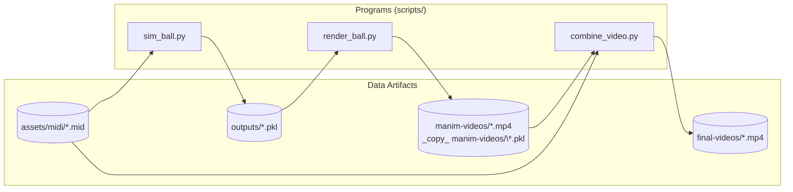

# bounce-music-py

Python 3.12.7

## Setup

### 0. Non-Python Dependencies

* Download [ffmpeg](https://ffmpeg.org/download.html) and add it to your system `PATH`.
* Download [FluidSynth](https://www.fluidsynth.org/) and place it under `C:\tools\fluidsynth`.
* Download a SoundFont file (e.g. **FluidR3_GM**, or any other of your choice) and place it under `assets/sf2/`

### 1. Python Dependencies

* Clone this repository.
* Install required packages:

  ```bash
  pip install -r ./requirements.txt
  ```

## Usage

Place your midi file under `assets/midi/`. Then the overall workflow is illustrated below.



For detailed script usage, run:

```bash
python scripts/???.py --help
```

> [!NOTE]
> `sim_ball.py` uses **Hydra** as its configuration system.
> Configuration is defined in YAML files located under `assets/conf`, and parameters can be dynamically overridden via command-line arguments.
> For details on Hydra’s configuration mechanism, see the [documents](https://hydra.cc/docs/intro/).
>
> During execution, Hydra will generate a configuration snapshot under the `outputs/` directory.
> The generated `.pkl` file will also be placed in this directory.

> [!IMPORTANT]
> Currently, `render_ball.py` uses **Manim** for rendering.
> To avoid timing drift introduced by aligning multiple animation segments—which would cause audio desynchronization—the entire rendering process is implemented as a single Manim animation.
>
> However, Manim exhibits poor memory performance in this scenario.
> In test cases, rendering a **960×960, 30 fps, 200 s** animation results in approximately **12 GB peak memory usage**, with growth showing a nonlinear pattern.
>
> On systems with limited memory, it is recommended to reduce rendering quality (e.g., resolution or frame rate) to mitigate memory pressure.
